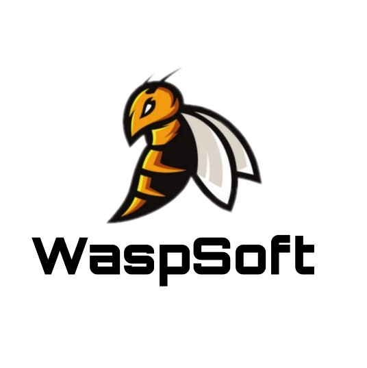

<h1 align="center">Restaurante el Rincon del sabor<h1>

<p align="center">
  <a href="">
    
  </a>
</p>

<h3 align="center">Gartsoft</h3>
<p align="center">version: v0.2.1-beta<p>

<p align="center">
  <a href="#">
    
  </a>
  <a href="https://atom.io/">
    
  </a>
  <a href="https://git-scm.com/">
    
  </a>
  <a href="https://www.npmjs.com/">
    
  </a>
  <a href="https://nodejs.org/es/">
    
  </a>
  <a href="https://handlebarsjs.com/">
    
  </a>
  <a href="https://getbootstrap.com/">
    
  </a>
</p>


Proyecto OpenSource

### Documentacion

La documentacion del proyecto esta almacenada en la [Landig pages](https://hguzman.github.io/Restaurante-El-Rincon-Del-Sabor) de este repocitorio donde se podra encontrar todo lo referente al proyecto como las graficas del la base de datos hasta los tipos de documentos como:

- TDR.
- terminos de referencia.
- Especificaciones de Requerimientos.
- Otros


#### Requisitos para colaborar en el proyecto.

 Para tener participacion de este proyecto debes tener instalado en tu equipo nodejs y npm.

- #### Instacion de Nodejs y npm

###### Para windows

 <br> Link [Nodejs](https://nodejs.org/es/download/)

instalacion normal Descargar aplicacion e instalarla normal como cualquier oto programa, Despues de haber instalado node.js entrar a la teminal y ejecutar los siguientes comandos:

``node --version
``

``npm --version
``

###### Para ubuntu y Mac

Para instalar NodeJS desde NodeSource, simplemente habrá que ejecutar alguno de los siguientes comandos para agregar la versión específica que nos interese. Para hacerlo tendremos que disponer de curl instalado. Si no cuentas con esta herramienta todavía, puedes instalarla con el comando:

``sudo apt install curl
``

Para instalar la versión 12 de node, no habrá más que ejecutar el comando:

``curl -sL https://deb.nodesource.com/setup_12.x | sudo -E bash -
``

Después de añadir alguno de estos PPA, ya podremos instalar la última versión de NodeJS desde el repositorio que elijamos. Si añadimos varios repositorios, se instalará la última versión de NodeJS y no la LTS.

``sudo apt install nodejs
``

Una vez terminada la instalación, los módulos NodeJS y npm deben estar instalados y listos para usar. Podremos usar los siguientes comandos para ver el número de versión instalado.

``node --version
``

``npm --version
``

:+1: ¡ ya estas Listo para comenzar a colaborar !  :+1:

##### inicia servidor con el comando

Dentro del Proyecto ejecuta en la terminal  el siguiente comando para iniciar el servidor en el puerto: 4000

``npm run dev
``

<br>http://localhost:4000

## La aplicación generada tiene la siguiente estructura de directorios:

```text
.src
├── lib
│   └── handlebars.hbs
├── package.json
├── public
│   ├── css
|   |   └─ estilos.css
│   ├── javascripts
│   └── stylesheets     
├── routes
│   ├── authentication.js
|   ├── index.js
│   └── link.js
├── views
|   ├── layouts
|   |   └─ main.hbs
|   ├── links
|   |   └─ signup.hbs
|   └── partial
|       ├── navegation.hbs
|       └── footer.hbs
|
├── database.js
├── index.js
└── keys.js
```
